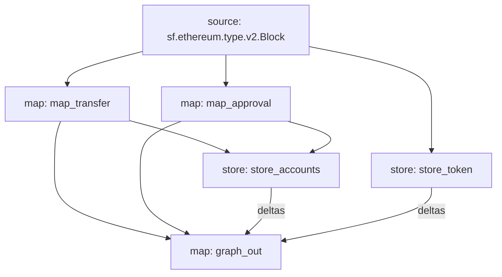

## Apecoin Substreams

```mermaid
graph TD;
  map_transfer[map: map_transfer];
  sf.ethereum.type.v2.Block[source: sf.ethereum.type.v2.Block] --> map_transfer;
  map_approval[map: map_approval];
  sf.ethereum.type.v2.Block[source: sf.ethereum.type.v2.Block] --> map_approval;
  store_accounts[store: store_accounts];
  map_transfer --> store_accounts;
  map_approval --> store_accounts;
  store_token[store: store_token];
  sf.ethereum.type.v2.Block[source: sf.ethereum.type.v2.Block] --> store_token;
  graph_out[map: graph_out];
  map_transfer --> graph_out;
  map_approval --> graph_out;
  store_accounts -- deltas --> graph_out;
  store_token -- deltas --> graph_out;

```
