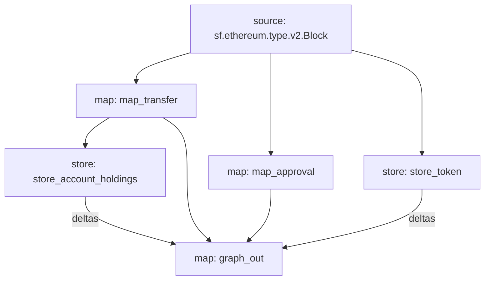

# Apecoin Substreams

Although this substreams is tracking the Apecoin Contract, you can use this as a template for any ERC20 token. You will need to update the `CONTRACT_ADDRESS`, `START_BLOCK` and the contract metadata in the `store_token` function to match your token.

## Quickstart

Make sure you have the latest versions of the following installed:

- [Rust](https://rustup.rs/)
- [Make](https://formulae.brew.sh/formula/make)
- [graph-cli](https://thegraph.com/docs/en/cookbook/quick-start/#2-install-the-graph-cli)
- [substreams-cli](https://substreams.streamingfast.io/getting-started/installing-the-cli)

### 1. Update the CONTRACT_ADDRESS & START_BLOCK variables in `src/utils/constants.rs`

```rust
pub const CONTRACT_ADDRESS: &str = "0xBC4CA0EdA7647A8aB7C2061c2E118A18a936f13D";
pub const START_BLOCK: u64 = 1521531;
```

### 2. Update the START_BLOCK, CONTRACT_ADDRESS and contract metadata in the store_token function

```rust
#[substreams::handlers::store]
pub fn store_token(block: eth::v2::Block, o: StoreSetProto<apecoin::Token>) {
    if block.number == START_BLOCK {
        let token = &apecoin::Token {
            name: "Apecoin".to_string(),
            address: append_0x(Hex(CONTRACT_ADDRESS).to_string().as_str()),
            decimal: "18".to_string(),
            symbol: "Ape".to_string(),
        };
        o.set(0, format!("Token: {}", token.address), &token);
    };
}
```

### 3. Update the initialBlock params for all modules within substreams.yaml

```yaml
  - name: map_transfers
    kind: map
    initialBlock: 14204533
    inputs:
      - source: sf.ethereum.type.v2.Block
    output:
      type: proto:apecoin.Transfers
```

### 4. Compile the Project with  `make build`

We now need to recompile our WASM binary with the new changes we made to the rust files.

### 5. Pack the spkg with `make package`

We need to bundle the protobuf definitions and the WASM binary into a single file. This is what we will deploy the subgraph.

### 6. Deploy the subgraph with `graph deploy`

Modify the package.json to point to your subgraph.
This endpoint will change if you are deploying to the hosted service or decentralized network. But replace this with the command that is appropriate for your setup.

### 7. Schema

```graphql
type Account @entity {
  id: ID!
  holdings: BigDecimal!
  sent: [Transfer!]! @derivedFrom(field: "sender")
  received: [Transfer!]! @derivedFrom(field: "receiver")
  approvals: [Approval!]! @derivedFrom(field: "owner")
}

type Transfer @entity(immutable: true) {
  id: ID!
  sender: Account
  receiver: Account!
  amount: String!
  token: Token!
  timestamp: BigInt!
  txHash: String!
  blockNumber: BigInt!
  logIndex: BigInt!
}

type Approval @entity(immutable: true) {
  id: ID!
  spender: String!
  owner: Account!
  amount: String!
  timestamp: BigInt!
  token: Token!
  txHash: String!
  blockNumber: BigInt!
  logIndex: BigInt!
}

type Token @entity {
  id: ID!
  name: String!
  address: String!
  symbol: String!
  decimals: String!
  transfers: [Transfer!]! @derivedFrom(field: "token")
  approvals: [Approval!]! @derivedFrom(field: "token")
}
```

### 8. Data Flow


